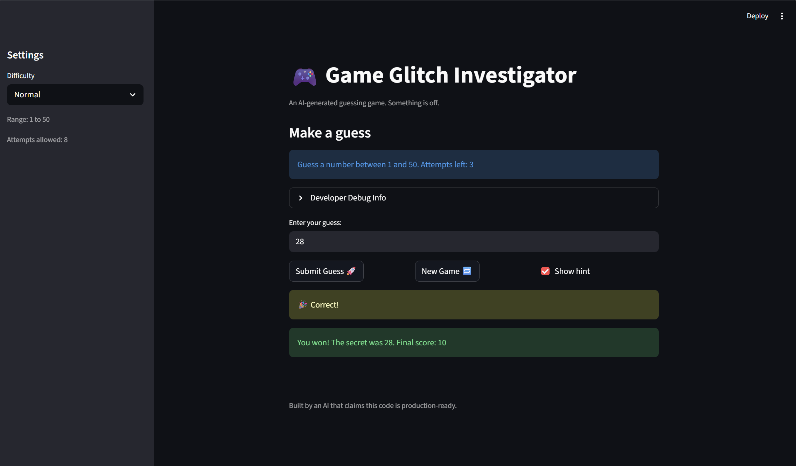

# 🎮 Game Glitch Investigator: The Impossible Guesser

## 🚨 The Situation

You asked an AI to build a simple "Number Guessing Game" using Streamlit.
It wrote the code, ran away, and now the game is unplayable. 

- You can't win.
- The hints lie to you.
- The secret number seems to have commitment issues.

## 🛠️ Setup

1. Install dependencies: `pip install -r requirements.txt`
2. Run the broken app: `python -m streamlit run app.py`

## 🕵️‍♂️ Your Mission

1. **Play the game.** Open the "Developer Debug Info" tab in the app to see the secret number. Try to win.
2. **Find the State Bug.** Why does the secret number change every time you click "Submit"? Ask ChatGPT: *"How do I keep a variable from resetting in Streamlit when I click a button?"*
3. **Fix the Logic.** The hints ("Higher/Lower") are wrong. Fix them.
4. **Refactor & Test.** - Move the logic into `logic_utils.py`.
   - Run `pytest` in your terminal.
   - Keep fixing until all tests pass!

## 📝 Document Your Experience

- [ ] Describe the game's purpose.
The games purpose is to let the user guess the number, based on a easy, normal, and hard difficulty. Each difficulty has a different range from numbers to guess from, as well as different number of tries. The goal of the user is to guess the number generated from the difficulty chosen before the number of tries runs out. 

- [ ] Detail which bugs you found.
The bugs I found when running the game is how the game gives you false and misleading hints when having the hint option on. The logic was wrong and needed to be fixed to give better hints and to have a better chance at guessing the number. Another bug would be how the number stays inconsistent with every time a guess is submitted. The number changes every time, which makes it impossible to have a chance at winning the game and guessing the right number. A third bug as how the range logic between the normal and hard difficulty is incorrect. The normal difficulty had a range of 1-100, and the hard difficulty had a range of 1-50. Realistically these two ranges should be flipped since having a bigger range of numbers is harder to guess a number from. 

- [ ] Explain what fixes you applied.
The fixes I applied were that I first corrected the hint logic when guessing a number, so that the hints are now correct and may actually lead the user to guessing the right number. Another fix was how the range of each difficulty was corrected so that they logically make sense. Each difficulty also has a certain amount of tries, to truly show the level of difficulty when playing. A third fix is having the number generated in each difficulty stay in its respective range. The number at first as only generated from 1-100, no matter what difficulty it was in. Now, when a difficulty is chosen, it will stay in its respective range. 

## 📸 Demo

- [ ] [Insert a screenshot of your fixed, winning game here]

## 🚀 Stretch Features

- [ ] [If you choose to complete Challenge 4, insert a screenshot of your Enhanced Game UI here]
